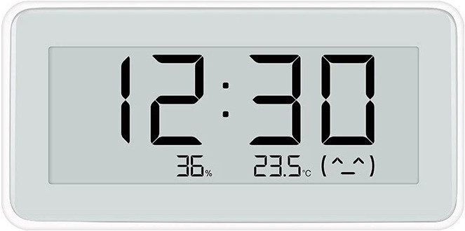
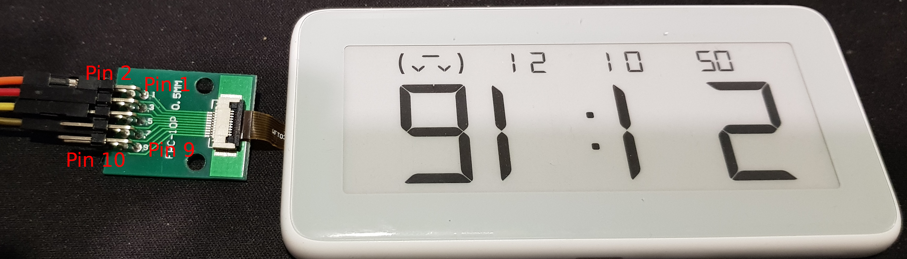

Library for controlling the e-ink display of the Xiaomi temperature and humidity pro device.

After disassembly, the display itself can be connected via a breakout board:

Controlling the e-ink display is somewhat similar to the other Xiaomi device described [here](https://github.com/GitJer/XiaomiMiaoMiaoCe). I haven't found what driver IC is used, so with the help of a logic analyzer I reverse engineered the protocol.

I used an ESP8266 (Wemos D1 mini) to control the display. The connections from the flat-flex-to-pins breakout board to the ESP8266 are as follows.

The flat flex contains 10 connections with a 0.5mm spacing with numbering as indicated in the image above. The following connections (defined in XiaomiMijaTempHumPro.h) to the ESP8266 are made:

| Breakout | ESP8266| Function  |
| -------- |:-------|:-----     |
| 1        | D2     | BUSY_N    |
| 2        | D5     | RST_N     |
| 3        | 3V3    | 3V3       |
| 4        | D7     | SPI ENABLE|
| 5        | D1     | SPI CLK   |
| 6        | D6     | SPI MOSI  |
| 7        | -      | -         |
| 8        | GND    | GND       |
| 9        | -      | -         |
| 10       | -      | -         |

The BUSY_N signal is generated by the driver IC to indicate it is ready to receive new data. So it is an input to the ESP8266. The other signals are outputs from the ESP8266 to the display driver.

If the screen remains blanc after startup it may be because the rtc memory 
of the WifiManager is not set or somehow corrupted. Using e.g. a mobile 
phone to connect to the access point XIAOMI_10.0.1.1 and then in a browser 
on the phone go to the website 10.0.1.1 allows you to set the ssid and 
passwd.

If the screen has just started up, it may take up to two minutes before the 
update occurs every minute.

For Deep-Sleep:

There needs to be a short between D0 and the RST on the esp8266. This 
allows the esp8266 to wake up after the specified Deep-Sleep time. With this short in place programming is not possible. So, make the short in a way that can easily be broken and restored.

During Deep-Sleep all GPIO values go to low, also the reset line to
the display. This means that the display thinks it is being reset and
reacts wrongly to a write_display. To remedy this, a short between the
reset line needs to be made. The 
consequence is that a regular (say once every hour) reset to clear the 
screen of any stray e-ink pixels will not work. I have tried to use a 
pull-up resistor and tried values from 4k7 to 220 ohm, but this did not 
help.

If the esp is reset during Deep-Sleep, it is still registered as a wake up 
from Deep-Sleep. Power up is not wake up from Deep-Sleep
